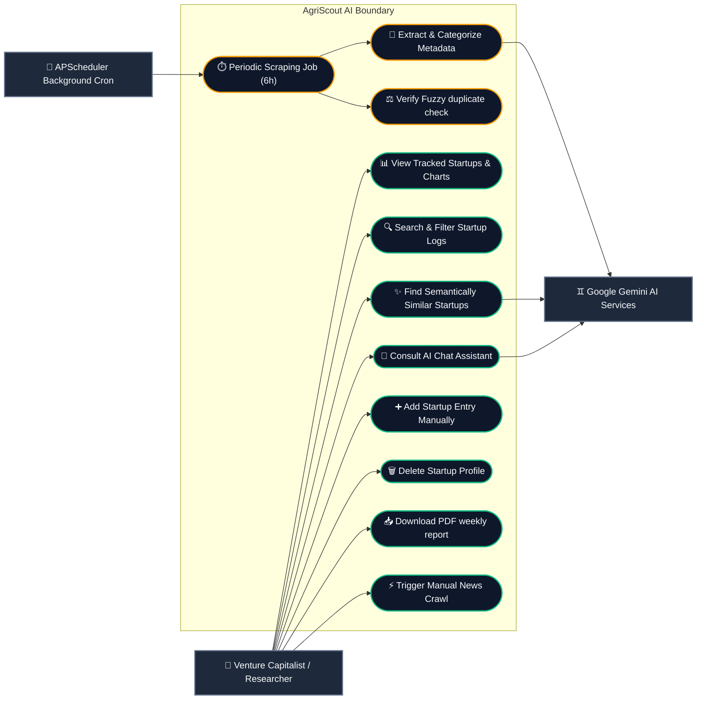
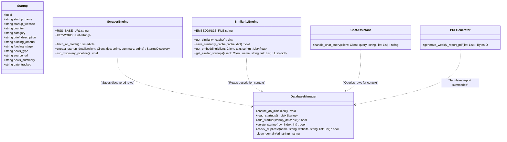
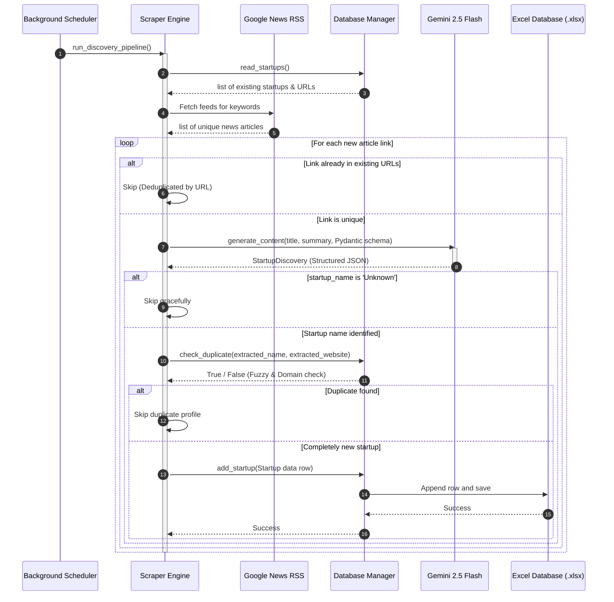
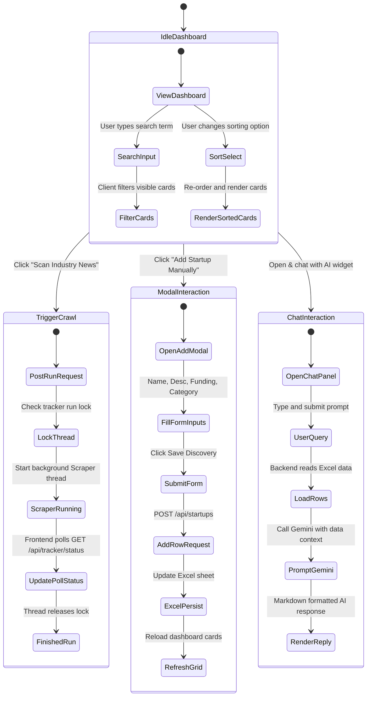

# AgriScout AI — Automated Startup Discovery & Market Intelligence System

AgriScout AI is a production-ready, full-stack intelligence platform designed for venture capitalists, accelerators, agriculture investors, and researchers. It automatically scrapes, monitors, categorizes, and tracks emerging agricultural technology (AgTech) startups from news portals, funding logs, and startup blogs.

The system uses **FastAPI** for API routes, **Next.js + TypeScript + Tailwind + Recharts** for a visual dashboard, and **Google Gemini 2.5 Flash** for metadata extraction, text categorization, semantic description similarity, and natural language database querying.

---

## 1. System Architecture & Diagram

The platform splits operations into a background scheduled crawler, a FastAPI REST server, and a Next.js single-page application.

```mermaid
flowchart TD
    %% Define Styles
    classDef client fill:#0f172a,stroke:#38bdf8,stroke-width:2px,color:#f8fafc;
    classDef server fill:#0f172a,stroke:#10b981,stroke-width:2px,color:#f8fafc;
    classDef storage fill:#0f172a,stroke:#f59e0b,stroke-width:2px,color:#f8fafc;
    classDef external fill:#0f172a,stroke:#64748b,stroke-width:2px,color:#f8fafc;

    subgraph FE ["💻 Frontend Client (Next.js & TypeScript)"]
        UI["🖥️ React Dashboard UI"]
        CH["📊 Recharts Analytics Panel"]
        QA["💬 AI Chat Widget"]
        SIM["🔍 Similarity Drawer"]
    end
    class FE,UI,CH,QA,SIM client;

    subgraph BE ["⚙️ Backend API Server (FastAPI & Uvicorn)"]
        API["🔌 REST API Endpoints"]
        SCH["⏱️ APScheduler (Cron Job)"]
        SCR["🕷️ Scraper & Collector"]
        FUZ["⚖️ RapidFuzz Deduplication"]
        EMB["🧠 Embedding similarity engine"]
        RPT["📄 ReportLab PDF Compiler"]
    end
    class BE,API,SCH,SCR,FUZ,EMB,RPT server;

    subgraph DB ["📁 Database Storage (Local Filesystem)"]
        EXCEL[("Excel DB: agtech_startups.xlsx")]
        EMB_CACHE[("JSON Cache: startup_embeddings.json")]
    end
    class DB,EXCEL,EMB_CACHE storage;

    subgraph EXT ["🌐 External Services"]
        GNEWS["📰 Google News RSS Feed"]
        GEMINI["♊ Google Gemini 2.5 Flash API"]
    end
    class EXT,GNEWS,GEMINI external;

    %% Flows
    SCH -->|Triggers Scrape Daily/6h| SCR
    SCR -->|Reads Feeds| GNEWS
    SCR -->|Deduplicates URL| EXCEL
    SCR -->|Structured extraction| GEMINI
    SCR -->|Fuzzy name duplicate check| FUZ
    SCR -->|Save rows progressively| EXCEL

    UI -->|GET /api/startups| API
    UI -->|GET /api/analytics| API
    UI -->|POST /api/chat| API
    UI -->|GET /api/startups/{id}/similar| API
    UI -->|GET /api/report/weekly| API

    API -->|Load & CRUD| EXCEL
    API -->|Embedding cosine distance| EMB
    EMB -->|Request embeddings| GEMINI
    EMB -->|Cache vectors| EMB_CACHE
    API -->|Inject data context Q&A| GEMINI
    API -->|Compile report flow| RPT
    RPT -->|Load rows| EXCEL
```

---

## 2. Use Case Diagram

The use case diagram illustrates user dashboard operations, background cron scheduler runs, and downstream dependencies on the Gemini AI service.



---

## 3. Class Diagram

The class diagram maps the modular object structures, models, and dependencies in the Python backend.



---

## 4. Sequence Diagram (News Discovery & AI Extraction)

This diagram tracks the lifecycle of an article discovery run from scheduler execution to database insertion.



---

## 5. Activity Diagram (User UI Dashboard Interactions)

Describes state transitions and processing branches during dashboard interaction.



---

## 6. Project Setup & Execution

### Prerequisites
- Python 3.10+
- Node.js v18+

### 1. Setup Backend
Activate the virtual environment, install dependencies, configure the environment variable, and boot the server:
```bash
# Navigate to root folder
cd /Users/nanthithavenkatachapathy/Desktop/agri_startup

# Activate virtual env
source .venv/bin/activate

# Install dependencies
pip install -r requirements.txt

# Configure Gemini Key
export GEMINI_API_KEY="<YOUR_GEMINI_API_KEY_HERE>"

# Launch FastAPI web server on port 8001
uvicorn backend.main:app --host 127.0.0.1 --port 8001
```

### 2. Setup Frontend
Install NPM node modules and run the Next.js development server:
```bash
# Open a second terminal window
cd /Users/nanthithavenkatachapathy/Desktop/agri_startup/frontend

# Install dependencies
npm install

# Run dev server
npm run dev
```

Next.js will start the dashboard at **`http://localhost:3001`**. Open this address in your web browser to interact with the platform.
