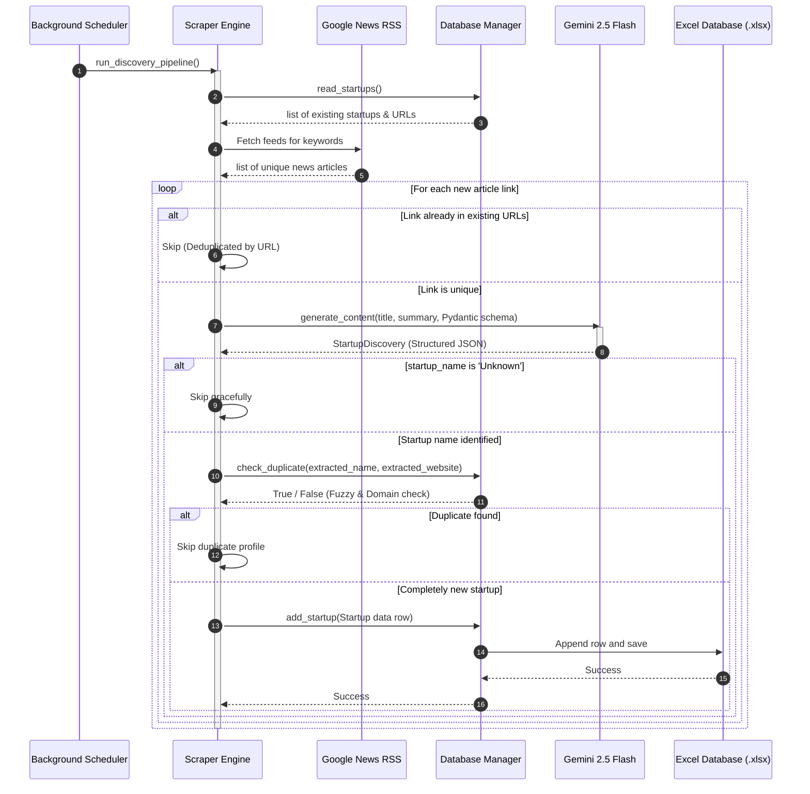
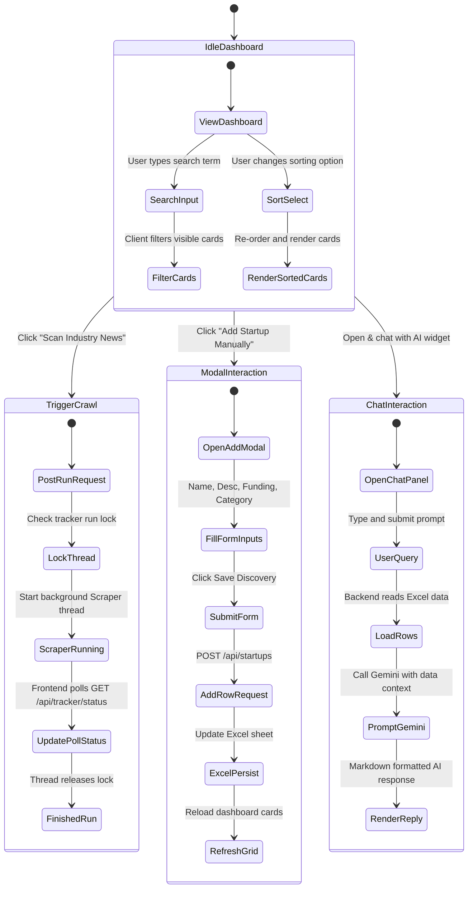

# AgriScout AI — Automated Startup Discovery & Market Intelligence System

AgriScout AI is a production-ready, full-stack intelligence platform designed for venture capitalists, accelerators, agriculture investors, and researchers. It automatically scrapes, monitors, categorizes, and tracks emerging agricultural technology (AgTech) startups from news portals, funding logs, and startup blogs.

The system uses **FastAPI** for API routes, **Next.js + TypeScript + Tailwind + Recharts** for a visual dashboard, and **Google Gemini 2.5 Flash** for metadata extraction, text categorization, semantic description similarity, and natural language database querying.

---

## 1. System Architecture & Diagram

The platform splits operations into a background scheduled crawler, a FastAPI REST server, and a Next.js single-page application.

```mermaid
graph TD
    subgraph Frontend [Next.js Dashboard Client]
        UI[React Dashboard UI]
        CH[Recharts Analytics]
        QA[AI Chat Panel]
        SIM[Similarity Drawer]
    end

    subgraph Backend [FastAPI Application Server]
        API[FastAPI Endpoints]
        SCH[APScheduler Job]
        SCR[News Scraper & Crawler]
        GEM[Gemini AI Engine]
        FUZ[RapidFuzz Duplicate Engine]
        EMB[Embedding Similarity Engine]
        RPT[ReportLab PDF Compiler]
    end

    subgraph Storage [Local Workspace Database]
        EXCEL[(Excel Database: agtech_startups.xlsx)]
        EMB_CACHE[(Embeddings Cache: startup_embeddings.json)]
    end

    %% Scraper Data Flow
    SCH -->|Triggers Every 6h| SCR
    SCR -->|Fetches Feeds| GNEWS[Google News RSS]
    SCR -->|Filters existing URLs| EXCEL
    SCR -->|Extracts metadata & categorizes| GEM
    GEM -->|Structured Outputs| SCR
    SCR -->|Fuzzy duplicate check| FUZ
    SCR -->|Progressive Save| EXCEL

    %% REST API Interactions
    UI -->|GET /api/startups| API
    UI -->|GET /api/analytics| API
    UI -->|POST /api/chat| API
    UI -->|GET /api/startups/{id}/similar| API
    UI -->|GET /api/report/weekly| API

    API -->|Read/Write CRUD| EXCEL
    API -->|Compute Cosine Sim| EMB
    EMB -->|Embed Description| GEM
    EMB -->|Cache / Read| EMB_CACHE
    API -->|Consult Context Q&A| GEM
    API -->|Compile Report| RPT
    RPT -->|Read| EXCEL
```

---

## 2. Use Case Diagram

The use case diagram illustrates user dashboard operations, background cron scheduler runs, and downstream dependencies on the Gemini AI service.

```mermaid
leftToRightDirection
%% Use Case Diagram
actor User as "Investor / Analyst"
actor System as "APScheduler Background Cron"
actor Gemini as "Gemini AI API"

rectangle "AgriScout AI System" {
    usecase UC1 as "View Tracked Startups & Charts"
    usecase UC2 as "Search & Filter Startups"
    usecase UC3 as "Find Semantically Similar Startups"
    usecase UC4 as "Consult AI Chat Assistant (Natural Language Q&A)"
    usecase UC5 as "Add Startup Manually"
    usecase UC6 as "Delete Startup Entry"
    usecase UC7 as "Download Weekly PDF Intelligence Report"
    usecase UC8 as "Trigger Manual News Crawl"
    usecase UC9 as "Periodic Scraping Job (Every 6h)"
    usecase UC10 as "Extract & Categorize Startup Metadata"
    usecase UC11 as "Verify Fuzzy Duplicate Matching"
}

User --> UC1
User --> UC2
User --> UC3
User --> UC4
User --> UC5
User --> UC6
User --> UC7
User --> UC8

System --> UC9
UC9 --> UC10
UC9 --> UC11

UC10 --> Gemini
UC3 --> Gemini
UC4 --> Gemini
```

---

## 3. Class Diagram

The class diagram maps the modular object structures, models, and dependencies in the Python backend.


---

## 4. Sequence Diagram (News Discovery & AI Extraction)

This diagram tracks the lifecycle of an article discovery run from scheduler execution to database insertion.



---

## 5. Activity Diagram (User UI Dashboard Interactions)

Describes state transitions and processing branches during dashboard interaction.



---

## 6. Project Setup & Execution

### Prerequisites
- Python 3.10+
- Node.js v18+

### 1. Setup Backend
Activate the virtual environment, install dependencies, configure the environment variable, and boot the server:
```bash
# Navigate to root folder
cd /Users/nanthithavenkatachapathy/Desktop/agri_startup

# Activate virtual env
source .venv/bin/activate

# Install dependencies
pip install -r requirements.txt

# Configure Gemini Key
export GEMINI_API_KEY="<YOUR_GEMINI_API_KEY_HERE>"

# Launch FastAPI web server on port 8001
uvicorn backend.main:app --host 127.0.0.1 --port 8001
```

### 2. Setup Frontend
Install NPM node modules and run the Next.js development server:
```bash
# Open a second terminal window
cd /Users/nanthithavenkatachapathy/Desktop/agri_startup/frontend

# Install dependencies
npm install

# Run dev server
npm run dev
```

Next.js will start the dashboard at **`http://localhost:3001`**. Open this address in your web browser to interact with the platform.
